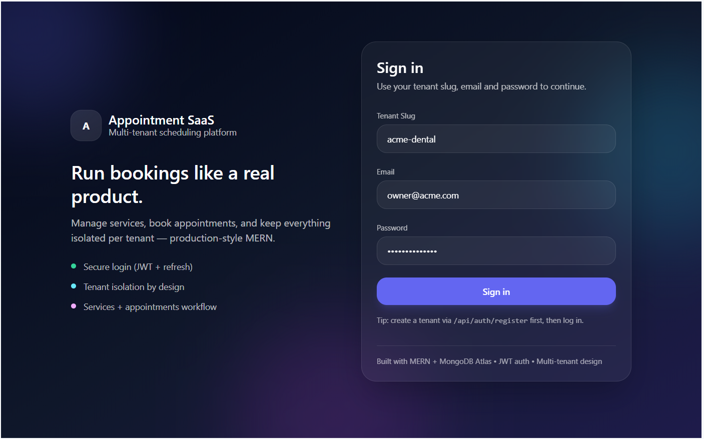
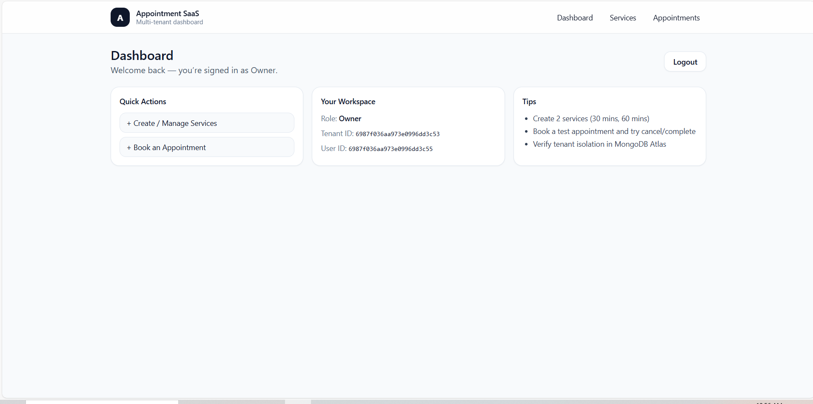
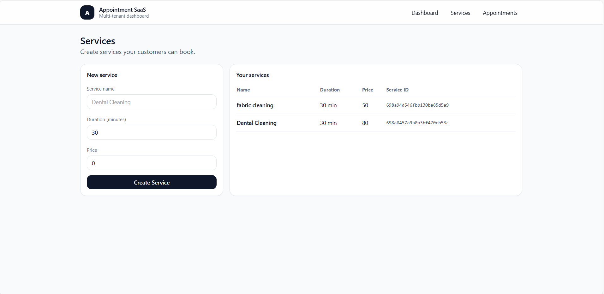
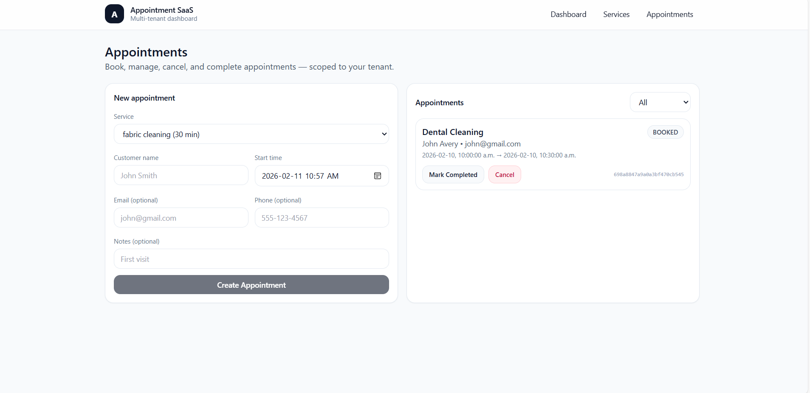

# Multi-Tenant Appointment SaaS

### Production-Style MERN Application

A production-style **multi-tenant appointment scheduling SaaS** built with the MERN stack.
This project demonstrates secure authentication, tenant-scoped data, and a modern React dashboard designed to reflect real-world SaaS architecture.

---

## 🚀 Live Project Goals

This project was built to demonstrate:

* Real-world SaaS architecture
* Secure authentication patterns
* Multi-tenant data isolation
* RESTful API design
* Full-stack MERN development
* Production-ready folder structure

---

## 🏷️ Tech Stack

### Frontend

* React (Vite)
* Axios
* Tailwind CSS

### Backend

* Node.js
* Express.js
* MongoDB Atlas
* Mongoose
* Zod validation
* bcrypt
* JWT Authentication

---

## ✨ Features

* Multi-tenant onboarding (Tenant + Owner created on registration)
* Email & password authentication
* Access Token + Refresh Token system
* Tenant-scoped services and appointments
* Appointment conflict detection
* Appointment status workflow:

  * BOOKED
  * CANCELLED
  * COMPLETED
* Protected routes
* Modern responsive UI

---

## 🧠 Architecture Overview

Client → Express API → Authentication Middleware → Controllers → MongoDB

Flow:

1. User registers → Tenant created
2. User logs in → JWT issued
3. Protected routes validate tenantId
4. All queries filtered by tenantId
5. Refresh token maintains session securely

---

## 📁 Project Structure

```
appointment-saas/
│
├── backend/
│   ├── controllers/
│   ├── middleware/
│   ├── models/
│   ├── routes/
│   ├── config/
│   └── server.js
│
├── frontend/
│   ├── src/
│   ├── components/
│   ├── pages/
│   └── api/
│
├── screenshots/
├── README.md
└── .gitignore
```

---

## 🔌 Core API Endpoints

### Authentication

| Method | Endpoint           | Description           |
| ------ | ------------------ | --------------------- |
| POST   | /api/auth/register | Create tenant + owner |
| POST   | /api/auth/login    | Returns access token  |
| POST   | /api/auth/refresh  | Returns new token     |
| POST   | /api/auth/logout   | Clears session        |

---

### User

| Method | Endpoint      |
| ------ | ------------- |
| GET    | /api/users/me |

---

### Services

| Method | Endpoint      |
| ------ | ------------- |
| GET    | /api/services |
| POST   | /api/services |

---

### Appointments

| Method | Endpoint                     |
| ------ | ---------------------------- |
| GET    | /api/appointments            |
| POST   | /api/appointments            |
| PATCH  | /api/appointments/:id/status |

Example request:

```json
{ "status": "CANCELLED" }
```

---

## 🔒 Security Practices

* Password hashing using bcrypt
* JWT authentication
* Refresh tokens in httpOnly cookies
* Tenant-level data isolation
* Environment variables for secrets
* Input validation using Zod

---

## 🚀 Local Setup

### Clone Repository

```bash
git clone <YOUR_REPO_URL>
cd appointment-saas
```

---

### Backend Setup

```bash
cd backend
npm install
```

Create `.env` file:

```
MONGODB_URI=your_connection_string
JWT_SECRET=your_secret
JWT_REFRESH_SECRET=your_refresh_secret
```

Run backend:

```bash
npm run dev
```

Backend runs on:

```
http://localhost:5000
```

---

### Frontend Setup

```bash
cd ../frontend
npm install
npm run dev
```

Frontend runs on:

```
http://localhost:5173
```

---

## 📸 Screenshots

Create a folder:

```
appointment-saas/screenshots/
```

Add images:

```
login.png
dashboard.png
services.png
appointments.png
```

Reference:

```markdown




```

---

## 🗺️ Roadmap

* Role-based access control
* Staff accounts
* Calendar integration
* Email notifications
* Pagination & filtering
* Stripe payments (future SaaS feature)
* Deployment to AWS or Render

---

## 📦 Deployment (Recommended for Portfolio)

Backend:

* Render
* Railway
* AWS EC2

Frontend:

* Vercel
* Netlify

Database:

* MongoDB Atlas

---

## 🎯 Why This Project Matters

This project demonstrates skills relevant to real production environments:

* Backend architecture
* Secure authentication
* SaaS multi-tenancy
* REST API design
* React dashboard design
* Clean folder structure
* Professional documentation

---

## 👨‍💻 Author

Aaron Ninan
GitHub: https://github.com/aninan1512
LinkedIn: https://www.linkedin.com/in/aaron-ninan-798938287

---

## ⭐ If you found this project useful

Consider giving it a star on GitHub.
